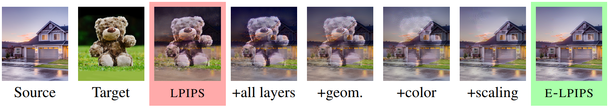
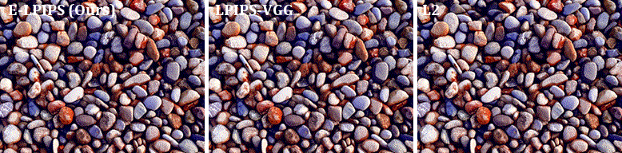
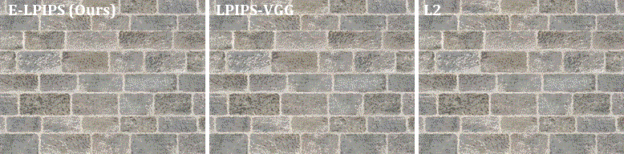
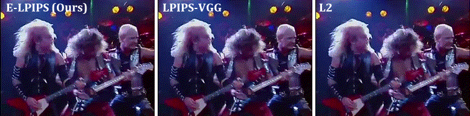

## E-LPIPS: Robust Perceptual Image Similarity via Random Transformation Ensembles



<p align="justify"><b>Figure 1:</b> <i>The neural perceptual image similarity metric LPIPS allows crafting images that look very different from a source image, while staying close to the original in terms of the metric (red). We fortify LPIPS by applying an ensemble of random transformations to the images before measurement: each additional transformation decreases the amount by which the image can be changed while staying at a constant LPIPS distance from the original. Our full E-LPIPS metric (green) retains the predictive power of LPIPS but is much more robust.</i></p>

This repository contains the implementation of the image similarity metric proposed in the following paper:

> **E-LPIPS: Robust Perceptual Image Similarity via Random Transformation Ensembles**<br>
> Markus Kettunen (Aalto University), Erik Härkönen (Aalto University), Jaakko Lehtinen (Aalto University, NVIDIA)<br>
> https://arxiv.org/abs/1906.03973
>
> <p align="justify"><b>Abstract:</b> <i>It has been recently shown that the hidden variables of convolutional neural net-works make for an efficient perceptual similarity metric that accurately predicts human judgment on relative image similarity assessment. First, we show that such learned perceptual similarity metrics (LPIPS) are susceptible to adversarial attacks that dramatically contradict human visual similarity judgment. While this is not surprising in light of neural networks’ well-known weakness to adversarial perturbations, we proceed to show that self-ensembling with an infinite family of random transformations of the input — a technique known not to render classification networks robust — is enough to turn the metric robust against attack, while retaining predictive power on human judgments. Finally, we study the geometry imposed by our novel self-ensembled metric (E-LPIPS) on the space of natural images. We find evidence of “perceptual convexity” by showing that convex combinations of similar-looking images retain appearance, and that discrete geodesics yield meaningful frame interpolation and texture morphing, all without explicit correspondences.</i></p>

## Acknowledgements

We thank Pauli Kemppinen, Frédo Durand, Miika Aittala, Sylvain Paris, Alexei Efros, Richard Zhang, Taesung Park, Tero Karras, Samuli Laine, Timo Aila, and Antti Tarvainen for in-depth discussions; and Seyoung Park for helping with the TensorFlow port of LPIPS. We acknowledge the computational resources provided by the Aalto Science-IT project.

## Resources

All material related to our paper is available via the following links:
* <a href="https://arxiv.org/abs/1906.03973">Paper PDF</a>
* <a href="media/ELPIPS_Supplemental.pdf">Supplemental PDF</a>
* <a href="../../releases/download/Supplemental/elpips_supplemental.zip">Supplemental images and videos (ZIP)</a>

## Licenses

The code is licensed under a [BSD 2-Clause License](LICENSE).<br>
Copyright information for the images in the <a href="inputs">inputs</a> directory is found in file [inputs/LICENSE](inputs/LICENSE).

The SqueezeNet and VGG16 implementations use pretrained weights from <a href="https://pytorch.org/docs/stable/torchvision/">PyTorch Torchvision</a>.

## System requirements

* Python 3.6
* TensorFlow 1.12 with GPU support

The environment can be set up with Anaconda by running the following commands:
1. `conda env create -f environment.yml`
2. `conda activate elpips`

## Experiment: Geodesic Interpolation

<a href="./media/geodesic/pebbles.gif"></a><!--
--><a href="./media/geodesic/bricks23.gif"></a><!--
--> <a href="./media/geodesic/jp.gif"></a>

**Figure 2.** Geodesic interpolation (shortest path) between two input images, computed in different distance metrics. No optical flow or explicit image warping is performed; the E-LPIPS geodesics' morphing and image transformations emerge purely from the geometry induced by the metric. Please see the paper for details.

## Usage

The minimum code to use E-LPIPS is as follows:
```
import elpips
metric = elpips.Metric(elpips.elpips_vgg(batch_size=1))
tf_distance = metric.forward(tf_image1, tf_image2)
distance = sess.run(tf_distance)
```

The images need to be NHWC tensors with N = batch_size.

## Known issues

* Code for creating geodesic interpolations not yet released (COMING SOON!)
* Running elpips with n > 1 (by configuring `elpips.elpips_vgg(batch_size, n)`) may freeze on some versions of TensorFlow due to tf.while_loop being unstable

## Examples

This repository contains scripts that demonstrate various ways to use E-LPIPS:

| File                            | Description
| :--------------                 | :----------
| [ex_simple_distance.py](ex_simple_distance.py)         | Evaluates the E-LPIPS distance between two images.
| [ex_evaluate_distance.py](ex_evaluate_distance.py)         | Evaluates the E-LPIPS distance of two images with an automatic iteration count.
| [ex_compare_distances.py](ex_compare_distances.py)         | Given a reference and two inputs, finds which one is closer.
| [ex_pairwise_average.py](ex_pairwise_average.py)         | Finds the E-LPIPS average (barycenter) of two images.
| [ex_bary10.py](ex_bary10.py)         | Finds the E-LPIPS average (barycenter) of ten similarly perturbed versions of an input image.
| [train_run.py](train_run.py)         | Trains the LPIPS weights for a network. Can be used for both E-LPIPS and LPIPS.
| [train_test_2afc.py](train_test_2afc.py)         | Runs the 2AFC test for a model.

## ex_simple_distance.py

A simple piece of code that evaluates the E-LPIPS distance between two images.
This is a stochastic evaluation and the result will vary slightly between evaluations.
For increased precision use parameter `-n=<number>` to average over more samples. The default value is 200.
This E-LPIPS implementation can also be used to evaluate LPIPS-VGG and LPIPS-SQUEEZENET distances.

Warning: Some versions of TensorFlow may have bugs that freeze the program for n > 1.

##### Computing E-LPIPS distance
```
> python ex_simple_distance.py inputs/adv_anchor.png inputs/adv_reference.png
Distance (e-lpips-vgg): 0.015902504324913025

> python ex_simple_distance.py inputs/adv_vgg_sqz.png inputs/adv_reference.png -n=1000
Distance (e-lpips-vgg): 0.08437894284725189
```

##### Computing LPIPS-VGG distance
```
> python ex_simple_distance.py inputs/adv_anchor.png inputs/adv_reference.png --metric=lpips_vgg
Distance (lpips-vgg): 0.025399859994649887

> python ex_simple_distance.py inputs/adv_vgg_sqz.png inputs/adv_reference.png --metric=lpips_vgg
Distance (lpips-vgg): 0.01992170885205269
```

##### Computing LPIPS-SQUEEZENET distance
```
> python ex_simple_distance.py inputs/adv_anchor.png inputs/adv_reference.png --metric=lpips_squeeze
Distance (lpips-squeeze): 0.02187105268239975

> python ex_simple_distance.py inputs/adv_vgg_sqz.png inputs/adv_reference.png --metric=lpips_squeeze
Distance (lpips-squeeze): 0.02113761380314827
```

## ex_evaluate_distance.py

Evaluates the E-LPIPS distance of two images with an automatic iteration count.

Continues sampling until error of mean reaches both '--max_absolute_error' and '--max_relative_error' (with 1.96 sigma bounds),
or sample count exceeds '--max_iterations'.


#### Computing E-LPIPS distance:
```
> python ex_evaluate_distance.py inputs/adv_anchor.png inputs/adv_reference.png

Evaluating E-LPIPS until abs_error < 0.01 and rel_error < 0.025, but at most 5000 iterations.
   [Processed samples: 50.  Current estimate: 0.02014327932614833 +- 0.002459478428475225 (12.2099%)]
   [Processed samples: 100.  Current estimate: 0.017760459808632733 +- 0.001853305389334146 (10.4350%)]
   ...
   [Processed samples: 2050.  Current estimate: 0.016594534157150675 +- 0.00041920152693091103 (2.5261%)]
   [Processed samples: 2100.  Current estimate: 0.016498371701066692 +- 0.00041416787483436755 (2.5104%)]
Distance (elpips_vgg): 0.01651083237308493
   +- 0.00041136488234548807 or 2.4915%  (bounds: 1.96 σ)
```
  

## ex_compare_distances.py
A simple piece of code that compares a reference image to two other images and tells which one of them is closer to the reference.
The code samples the distances of the two images simultaneously, using the same dropout and random input transformations for both.
This makes the error in the distance samples for d1 and d2 correlated so the comparison requires fewer samples.

##### Comparing which of two images is closer to a reference, using E-LPIPS:
```
> python ex_compare_distances.py inputs/adv_reference.png inputs/adv_anchor.png inputs/adv_vgg_sqz.png
Image 'inputs/adv_anchor.png' is closer! (*0.01716* - 0.08547 = -0.06831 < 0)
```

##### Comparing which of two images is closer to a reference, using LPIPS-VGG:
```
> python ex_compare_distances.py inputs/adv_reference.png inputs/adv_anchor.png inputs/adv_vgg_sqz.png --metric=lpips_vgg
Image 'inputs/adv_vgg_sqz.png' is closer! (0.02540 - *0.01992* = 0.00548 > 0)
```

##### Comparing which of two images is closer to a reference, using LPIPS-SQUEEZENET:
```
> python ex_compare_distances.py inputs/adv_reference.png inputs/adv_anchor.png inputs/adv_vgg_sqz.png --metric=lpips_squeeze
Image 'inputs/adv_vgg_sqz.png' is closer! (0.02187 - *0.02114* = 0.00073 > 0)
```

## ex_pairwise_average.py

Finds the E-LPIPS average (barycenter) of two images. Starts from random noise and optimizes for the image that minimizes
the sum of the squared E-LPIPS distances to the input images.

Outputs are generated by default into directory out_bary2, but this directory may be changed with --outdir.
The output directory will contain snapshots of the optimization, which are often quite interesting.

The final result will be outdir/100000.png by default.

Note that this simple algorithm is very slow and may take hours to complete.
The results will only be representative near the maximum iteration count.


##### Finding the E-LPIPS average of two images:
```
> python ex_pairwise_average.py inputs/cat.png inputs/dog.png --outdir=out_bary2_cat_dog_elpips
```
   
##### Finding the LPIPS-VGG average of two images:
```
> python ex_pairwise_average.py inputs/cat.png inputs/dog.png --outdir=out_bary2_cat_dog_vgg --metric=lpips_vgg
```
   
##### Finding the LPIPS-SQUEEZENET average of two images:
```
> python ex_pairwise_average.py inputs/cat.png inputs/dog.png --outdir=out_bary2_cat_dog_vgg --metric=lpips_squeeze
```

## ex_bary10.py

Finds the E-LPIPS average (barycenter) of ten similarly perturbed versions of an input image. Starts from random noise
and optimizes for the image that minimizes the sum of the squared E-LPIPS distances to the input images.

Supported perturbations include additive Gaussian noise and small shifts.

Outputs are generated by default into directory out_bary10, but this directory may be changed with --outdir.
The output directory will contain snapshots of the optimization, which are often quite interesting.

The final result will be outdir/100000.png by default.

Note that this simple algorithm is very slow and may take hours to complete.
The results will only be representative near the maximum iteration count.


Running the code with any metric will also generate the corresponding L2 result with the name "mean_image.png".


##### Finding the E-LPIPS average of ten noisy images:
```
> python ex_bary10.py inputs/cat.png --mode=noise --outdir=out_bary10_cat_noise_elpips
```
   
##### Finding the E-LPIPS average of ten shifted images:
```
> python ex_bary10.py inputs/cat.png --mode=shift --outdir=out_bary10_cat_shift_elpips
```

##### Finding the corresponding LPIPS averages:
```
> python ex_bary10.py inputs/input_cat.png --mode=noise --metric=lpips_vgg --outdir=out_bary10_cat_noise_lpips_vgg
> python ex_bary10.py inputs/input_cat.png --mode=shift --metric=lpips_vgg --outdir=out_bary10_cat_shift_lpips_vgg

> python ex_bary10.py inputs/input_cat.png --mode=noise --metric=lpips_squeeze --outdir=out_bary10_cat_noise_lpips_sqz
> python ex_bary10.py inputs/input_cat.png --mode=shift --metric=lpips_squeeze --outdir=out_bary10_cat_shift_lpips_sqz
```

## train_run.py

Trains the LPIPS weights for a network. Can be used for both E-LPIPS and LPIPS.
Use the script 'lpips_scripts/download_dataset.sh' included from the original LPIPS distribution to download the dataset.

The training script will pre-process the datasets into single-file datasets in the Darc format (darc.py) before use.
This will take some time, but will immensely speed up training at least on some environments.

An example script 'train_squeeze_ensemble.sh' is provided for training a SqueezeNet version of E-LPIPS,
with max pooling instead of average pooling since the average pooled version would require re-training SqueezeNet.

The custom weights stored in numpy format can be taken into use by the flag 'custom_lpips_weights' given
to the constructor of class elpips.Metric.

## train_test_2afc.py
Runs the 2AFC test for a model. See file 'train_test_2afc_squeeze_example.sh' for an example.
